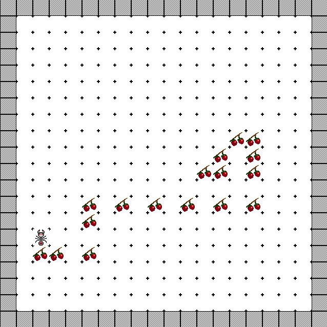

DEvol
=====

Framework for genetic programming over typed expressions

Dependencies
============
Library isn't dependent on any external library, but demostration application (ant problem solver) is depended on [SDL2](http://www.libsdl.org/). Installation command for fedora:
```
yum install SDL2-devel
```

Building
========

You need [dmd](http://dlang.org/download.html) `v2.065` and [dub](http://code.dlang.org/download) `v0.9.21`. Next clone the repo and run in repo root directory to build demo application:
```
dub build --config=ant --build=release
```

If you want to develop your own applications based on DEvol you should add the repo in local dub registry (library isn't released yet. You can ommit the step, if the library is added to offical dub registry):
```
dub add-local .
```

Now you can create your own dub packages and reference to the DEvol in the following way in you `dub.json` file:
```
"dependencies": {
  "devol": "~master"
}
```
Screenshots
===========
Ant problem solver - the task is find algorithm that can collect all food chained with gaps. Ant can rotate, move forward and check if there is food in front of it. 

